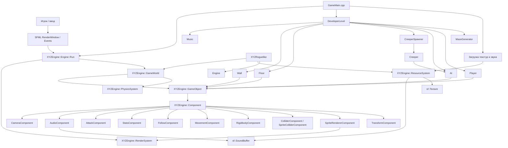
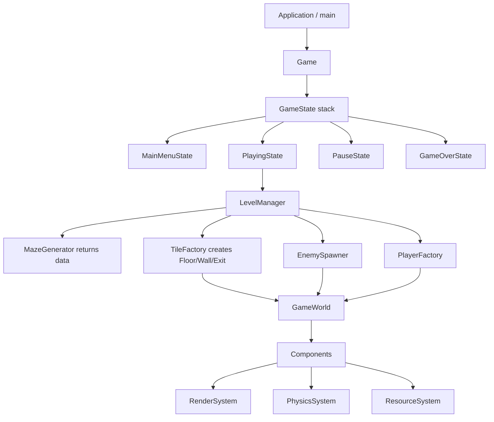

# Rogalique / XYZRoguelike: архитектурный отчет по 2D C++ игре

Дата анализа: 2026-09-16  
Репозиторий: `https://github.com/Ylu-ylu/Rogalique`  
Локальная копия: `D:\XYZ C++ for gamedevelopment\Rogalique_HW15_v1 -check3`  
Текущая ветка на момент проверки: `main`, синхронизирована с `origin/main`

## 1. Краткое резюме

Проект представляет собой учебную 2D roguelike-игру на C++ с использованием SFML. По README игра задумана как проект, где игрок проходит случайно сгенерированный лабиринт, сражается с монстрами и собирает награды. В текущем коде основная рабочая игровая линия реализована через отдельный игровой проект `XYZRoguelike` и самописный 2D-движок `Engine`.

Ключевая архитектурная идея: самописный движок предоставляет `GameObject` + `Component` модель, глобальные подсистемы рендера, ресурсов, физики и мира, а игра поверх этого строит игрока, врагов, стены, пол, генерацию лабиринта и переходы между игровыми состояниями.

Проект уже содержит признаки классической игровой архитектуры:

- главный игровой цикл;
- менеджер мира;
- компонентную модель игровых объектов;
- стек игровых состояний;
- менеджер ресурсов;
- систему физики и коллизий;
- генератор лабиринта;
- спавнер врагов;
- логирование;
- CI-сборку через GitHub Actions;
- минимальные unit-тесты для математического `Vector`.

## 2. Технологический стек

| Область | Используется |
|---|---|
| Язык | C++17 |
| IDE / build | Visual Studio / MSBuild / `.sln`, `.vcxproj` |
| Графика | SFML 2.5.1 |
| Аудио | SFML Audio, OpenAL |
| Тесты | GoogleTest через NuGet package |
| CI | GitHub Actions, `windows-latest`, MSBuild |
| Платформа | Windows, x64 |

## 3. Структура решения

Основные проекты в `Game.sln`:

| Проект | Назначение |
|---|---|
| `Engine` | Самописный 2D-движок: игровые объекты, компоненты, рендер, ресурсы, физика, трансформации |
| `XYZRoguelike` | Основная игра: игрок, враги, лабиринт, игровые состояния, сцены, меню |
| `EngineTest` | Unit-тесты движка, сейчас покрывают в основном `Vector` |
| `SFMLTemplate`, `ApplesGame` | Похоже на шаблонные/учебные проекты рядом с основной игрой |
| `SFML` | Локально сохраненная SFML 2.5.1 с include/lib/bin/doc |

Главный игровой проект `XYZRoguelike` зависит от:

- `Engine.lib`;
- SFML static libraries: `sfml-main`, `sfml-graphics`, `sfml-window`, `sfml-system`, `sfml-audio`, `sfml-network`;
- системных Windows-библиотек: `ws2_32`, `opengl32`, `freetype`, `winmm`, `gdi32`, `openal32`, `flac`, `vorbis*`, `ogg`.

## 4. Схема зависимостей



## 5. Игровой запуск и runtime-flow

Фактическая точка входа находится в `XYZRoguelike/GameMain.cpp`.

Последовательность запуска:

1. Создается окно `sf::RenderWindow` с разрешением `1280x720`.
2. Окно передается в `XYZEngine::RenderSystem`.
3. Проверяются пути к ресурсам.
4. Через `ResourceSystem` загружаются texture maps:
   - `Wizard.png` как `ai`;
   - `Man.png` как `Player`;
   - `Creeper.png` как `Creeper`;
   - `Floor.png` как `level_floors`;
   - `Wall.png` как `level_walls`.
5. Загружается звук `neon-gaming.wav` как `music`.
6. Создается `DeveloperLevel`.
7. Вызывается `DeveloperLevel::Start()`.
8. Запускается `XYZEngine::Engine::Run()`.

`Engine::Run()` реализует основной game loop:

- считывает `deltaTime`;
- обрабатывает закрытие окна;
- очищает окно;
- вызывает `GameWorld::Update(deltaTime)`;
- вызывает `GameWorld::FixedUpdate(deltaTime)`;
- вызывает `GameWorld::Render()`;
- вызывает `GameWorld::LateUpdate()`;
- вызывает `display()`.

Важно: в проекте также есть класс `XYZRoguelike::Game` со стеком игровых состояний, но текущий `GameMain.cpp` запускает `DeveloperLevel` напрямую через движок. То есть код состояний игры существует, но фактический runtime-старт сейчас идет по более прямому сценарию `DeveloperLevel -> Engine`.

## 6. Архитектура движка `Engine`

### 6.1 GameObject + Component

Центральная модель движка построена вокруг `XYZEngine::GameObject` и `XYZEngine::Component`.

`GameObject`:

- хранит имя объекта;
- хранит список `Component*`;
- хранит дочерние `GameObject*`;
- умеет добавлять компоненты через шаблонный `AddComponent<T>()`;
- умеет искать компоненты через `GetComponent<T>()`;
- умеет искать компоненты в дочерних объектах;
- вызывает `Update()` и `Render()` у компонентов.

`Component`:

- базовый абстрактный класс;
- содержит указатель на `GameObject`;
- требует реализации `Update(float deltaTime)` и `Render()`.

Это не полноценный ECS в строгом смысле, потому что данные и поведение не разделены по системам полностью, но это классическая component-based архитектура, близкая к Unity-подходу.

### 6.2 GameWorld

`GameWorld` выполняет роль глобального контейнера мира:

- создает `GameObject`;
- обновляет все объекты;
- вызывает fixed update физики;
- рендерит все объекты;
- откладывает уничтожение объектов до `LateUpdate`;
- очищает сцену.

`GameWorld` реализован как singleton.

### 6.3 RenderSystem

`RenderSystem` хранит главный `sf::RenderWindow` и предоставляет метод `Render(const sf::Drawable&)`.

Это тонкий wrapper/facade над SFML render window. Он позволяет компонентам рендера не хранить окно напрямую, а обращаться к общей подсистеме.

### 6.4 ResourceSystem

`ResourceSystem` отвечает за:

- загрузку одиночных текстур;
- загрузку texture map / sprite sheet с нарезкой на элементы;
- хранение `sf::Texture*`;
- загрузку `sf::SoundBuffer`;
- выдачу shared/copy доступа к текстурам.

Система также реализована как singleton.

Особенность реализации: ресурсы хранятся через raw pointers. Часть очистки есть для текстур и texture maps, но для звуков `Clear()` сейчас не вызывает отдельную очистку всех sound buffers.

### 6.5 PhysicsSystem

`PhysicsSystem`:

- хранит список `ColliderComponent*`;
- проверяет пересечения `sf::FloatRect`;
- различает trigger и physical collision;
- вызывает callback-подписки на collision/trigger;
- корректирует позицию объекта при столкновении;
- работает с фиксированным шагом `0.02f`.

Физика простая AABB-based, достаточная для tile-based 2D игры.

## 7. Архитектура игрового слоя `XYZRoguelike`

### 7.1 DeveloperLevel

`DeveloperLevel` является основной сценой текущего запуска. Он наследуется от `Scene` и реализует:

- `Start()`;
- `Restart()`;
- `Stop()`.

В `Start()`:

- размер уровня растет с `currentLevel`;
- выбирается случайный выход;
- создаются стены и полы;
- запускается `MazeGenerator`;
- создается `Player`;
- настраивается камера;
- создается базовый `AI`;
- создается `CreeperSpawner`;
- спавнятся обычные враги, усиленные враги, волны и босс каждые 3 уровня;
- создается trigger выхода;
- запускается музыка.

`DeveloperLevel` сейчас одновременно отвечает за несколько вещей: генерацию уровня, создание объектов, масштабирование сложности, спавн врагов, переход между уровнями, музыку и очистку сцены. Это рабочее решение для учебного проекта, но класс уже выглядит как главный orchestrator с высокой связностью.

### 7.2 MazeGenerator

`MazeGenerator` генерирует лабиринт с помощью depth-first search/backtracking:

- хранит `grid` как `std::vector<std::vector<bool>>`;
- стартует со случайной клетки;
- использует `std::stack`;
- выбирает доступные направления на 2 клетки;
- прорезает проходы;
- добавляет `Floor` и `Wall` напрямую в `DeveloperLevel`.

Архитектурно это генератор, но он не полностью отделен от сцены: он хранит указатель на `DeveloperLevel` и напрямую модифицирует `level->floors` и `level->walls`.

### 7.3 Player

`Player` является wrapper-классом над `GameObject`.

При создании добавляет компоненты:

- `SpriteRendererComponent`;
- `CameraComponent`;
- `InputComponent`;
- `MovementComponent`;
- `RigidbodyComponent`;
- `SpriteColliderComponent`;
- `StatsComponent`;
- `AttackComponent`.

Игрок управляется через компонент движения и ввода, а камера привязана к объекту игрока.

### 7.4 AI / Creeper / CreeperSpawner

`AI` создает enemy `GameObject` и добавляет ему:

- renderer;
- follow component;
- rigidbody;
- collider;
- stats;
- attack.

`Creeper` наследуется от `AI` и переопределяет `Clone()`. Есть две модели создания creeper:

- через базовый `AI(player, enemyName, id)`, где объект уже создается;
- через конструктор `Creeper(position, target)`, который дополнительно создает свой `GameObject`.

Это место требует осторожности: конструктор `Creeper(const Vector2Df&, GameObject*)` вызывает базовый `AI(position, target)`, который уже создает объект, а затем сам `Creeper` снова создает `GameObject("Creeper")`. Для текущего спавнера чаще используется конструктор `Creeper(playerTarget, "Creeper", i)`, поэтому проблема может не проявляться в основной ветке запуска, но архитектурно это риск дублирования объектов.

`CreeperSpawner`:

- хранит `std::vector<std::unique_ptr<AI>> enemies`;
- умеет считать живых врагов через `StatsComponent`;
- выбирает случайные валидные позиции по grid лабиринта;
- поддерживает `SpawnConfig`;
- поддерживает preset-конфигурации `Normal`, `Hard`, `Boss`, `Wave`;
- допускает кастомную factory-функцию для создания врага.

### 7.5 Игровые состояния

В проекте есть отдельная state machine:

- `GameStateType::MainMenu`;
- `Playing`;
- `GameOver`;
- `GameWin`;
- `ExitDialog`;
- `Records`.

`Game` хранит `std::vector<GameState> stateStack` и поддерживает операции:

- push state;
- pop state;
- switch state;
- draw видимых состояний;
- обработку событий окна;
- обновление активного состояния.

`GameState` внутри создает конкретный `GameStateData` через `switch` по enum.

Это достаточно чистый вариант stack-based state machine для экранов игры и меню. Но сейчас он не является главным путем запуска в `GameMain.cpp`, потому что активная точка входа запускает `DeveloperLevel` напрямую.

## 8. Найденные паттерны проектирования

### 8.1 Singleton

Используется явно:

- `Engine::Instance()`;
- `GameWorld::Instance()`;
- `RenderSystem::Instance()`;
- `ResourceSystem::Instance()`;
- `PhysicsSystem::Instance()`;
- `LoggerRegistry::getInstance()`.

Назначение: обеспечить глобальный доступ к подсистемам движка.

Плюсы:

- просто использовать в учебном проекте;
- удобно подключать подсистемы из игровых классов.

Минусы:

- сильная глобальная связность;
- сложнее тестировать;
- сложнее иметь несколько миров/окон/контекстов;
- жизненный цикл подсистем размыт.

### 8.2 Component / Entity-Component style

Используется в `GameObject` + `Component`.

Примеры компонентов:

- `TransformComponent`;
- `SpriteRendererComponent`;
- `InputComponent`;
- `MovementComponent`;
- `FollowComponent`;
- `RigidbodyComponent`;
- `ColliderComponent`;
- `SpriteColliderComponent`;
- `StatsComponent`;
- `AttackComponent`;
- `AudioComponent`;
- `CameraComponent`.

Это ключевой архитектурный паттерн проекта.

### 8.3 State

Используется для экранов/режимов игры:

- базовый интерфейс `GameStateData`;
- конкретные состояния `GameStateMainMenuData`, `GameStatePlayingData`, `GameStatePauseMenuData`, `GameStateGameOverData`, `GameStateGameWinData`, `GameStateRecordsData`;
- `GameState` как wrapper;
- `Game` как state stack manager.

### 8.4 Observer

Есть явная реализация:

- `IObservable`;
- `IObserver`;
- `AddObserver`;
- `Emit`;
- `Notify`.

Также callback-подписки в `ColliderComponent` являются практическим event/listener-подходом:

- `SubscribeCollision`;
- `SubscribeTriggerEnter`;
- `SubscribeTriggerExit`.

### 8.5 Factory / Configurable Factory

`CreeperSpawner` использует `SpawnConfig`, где есть:

```cpp
std::function<std::unique_ptr<AI>(GameObject*, const std::string&, int)> enemyFactory;
```

Это позволяет подменить способ создания врага без изменения самого спавнера. По смыслу это factory callback / strategy factory.

### 8.6 Prototype

`AI::Clone()` и `Creeper::Clone()` являются признаками Prototype pattern. Объект может создавать новую копию своего типа с другой позицией и именем.

### 8.7 Strategy

Частично проявляется в:

- `enemyFactory` внутри `SpawnConfig`;
- разных preset-конфигурациях спавна;
- компонентах поведения вроде `FollowComponent`, `MovementComponent`, `InputComponent`, которые задают разные аспекты поведения объекта.

Это не классическая иерархия Strategy-интерфейсов, но архитектурная идея похожая: поведение меняется через состав объекта и конфигурацию.

### 8.8 Composite

`GameObject` содержит дочерние `GameObject*`, а `TransformComponent` поддерживает parent transform. Это напоминает Composite для иерархии объектов сцены.

### 8.9 Facade / Service Locator

`RenderSystem`, `ResourceSystem`, `GameWorld` работают как упрощенные фасады к SFML/ресурсам/миру. Из-за singleton-доступа они также похожи на service locator.

### 8.10 Template Method / polymorphic lifecycle

`Scene` задает жизненный цикл `Start/Restart/Stop`, а `DeveloperLevel` реализует конкретное поведение. `Component` задает `Update/Render`, а компоненты реализуют детали.

## 9. Данные и владение памятью

В проекте используются разные модели владения:

| Место | Модель |
|---|---|
| `GameObject` / `Component` | raw pointers, ручной `new/delete` |
| `DeveloperLevel` walls/floors | `std::unique_ptr` |
| `DeveloperLevel` player/ai | `std::shared_ptr` |
| `CreeperSpawner` enemies | `std::unique_ptr<AI>` |
| `GameState` data | `std::shared_ptr<GameStateData>` |
| `ResourceSystem` textures/sounds | raw pointers |
| Observer | `std::weak_ptr<IObserver>` |

Сильная сторона: в игровом слое уже активно используются `unique_ptr` и `shared_ptr`.

Риск: движок и ресурсы все еще во многом используют raw pointers. Это требует аккуратного жизненного цикла и может приводить к утечкам, dangling pointers или double ownership при развитии проекта.

## 10. Игровая логика

### Основной игровой цикл

Сейчас активная линия:

```text
main()
  -> load resources
  -> DeveloperLevel::Start()
  -> Engine::Run()
      -> GameWorld::Update()
      -> GameWorld::FixedUpdate()
      -> GameWorld::Render()
      -> GameWorld::LateUpdate()
```

### Генерация уровня

Уровень строится процедурно:

- размер растет от номера уровня;
- внешний контур заполняется стенами;
- внутренность заполняется полами;
- `MazeGenerator` прорезает проходы;
- выход выбирается случайно на границе;
- для выхода создается trigger;
- при входе игрока в trigger вызывается переход на следующий уровень.

### Сложность

Сложность масштабируется через:

- рост размеров уровня;
- рост количества врагов;
- `healthMultiplier`;
- `armorMultiplier`;
- `speedMultiplier`;
- `damageMultiplier`;
- волны;
- босс каждые 3 уровня.

### Враги

Враги следуют за игроком через `FollowComponent`, имеют статы и атаку. Спавнер старается размещать их на доступных клетках лабиринта и может учитывать минимальную дистанцию до игрока.

## 11. Сильные стороны проекта

1. Есть собственный понятный 2D-движок.
2. Архитектура уже разделена на engine layer и game layer.
3. Используется компонентная модель, удобная для игр.
4. Есть процедурная генерация лабиринта.
5. Есть масштабирование сложности.
6. Есть state machine для меню и экранов.
7. Есть CI-сборка под Windows.
8. Есть unit-тесты, пусть пока и минимальные.
9. Ресурсы централизованно загружаются через `ResourceSystem`.
10. Есть логирование в консоль и файл.

## 12. Архитектурные риски и технический долг

### 12.1 Два конкурирующих сценария запуска

В проекте есть полноценный `Game` со стеком состояний, но `GameMain.cpp` запускает `DeveloperLevel` напрямую. Это создает архитектурную неоднозначность:

- либо игра должна идти через `Game` и `GameStatePlaying`;
- либо state machine осталась от старой версии и частично не используется.

Рекомендация как разработчика: выбрать один главный runtime-flow и привести остальные части к нему.

### 12.2 Raw pointers в ядре движка

`GameObject`, `Component`, `ResourceSystem`, `RenderSystem` активно используют raw pointers. Это нормально для учебного этапа, но с ростом проекта лучше постепенно перейти на более явную модель владения.

Особенно внимательно стоит смотреть на:

- удаление компонентов;
- уничтожение GameObject;
- хранение текстур;
- хранение звуков;
- указатель окна в `RenderSystem`;
- collider pointers в `PhysicsSystem`.

### 12.3 ResourceSystem очищает не все ресурсы

`ResourceSystem::Clear()` очищает текстуры и texture maps, но не очищает `sounds`. Для короткой игры это может быть незаметно, но архитектурно это утечка ответственности.

### 12.4 `Creeper` потенциально создает лишний GameObject

Конструктор `Creeper(position, target)` вызывает базовый конструктор `AI(position, target)`, который создает `GameObject`, а затем `Creeper` создает второй `GameObject`. Основной спавнер использует другой конструктор, но сам класс содержит опасную ветку.

### 12.5 Сильная связность `DeveloperLevel`

`DeveloperLevel` одновременно:

- генерирует уровень;
- создает tile objects;
- создает игрока;
- настраивает камеру;
- управляет врагами;
- запускает музыку;
- управляет переходом уровней;
- очищает мир.

Это удобно для быстрого учебного проекта, но при росте игры класс станет трудно поддерживать.

### 12.6 `MazeGenerator` напрямую меняет сцену

Генератор лабиринта хранит указатель на `DeveloperLevel` и напрямую добавляет `Floor`/`Wall`. Более чистая архитектура: генератор возвращает данные лабиринта, а сцена уже решает, какие GameObject создавать.

### 12.7 Нейминг и опечатки

Есть несколько признаков технического долга:

- `AttackComponen.h` вместо `AttackComponent.h`;
- `LooseGame()` вместо `LoseGame()`;
- `fallowTarget` вместо `followTarget`;
- `levelLoder` вместо `levelLoader`;
- ветка `features/isue-2` с опечаткой в `issue`.

На работу проекта это не обязательно влияет, но ухудшает читаемость.

### 12.8 Смешение языков в комментариях и кодировке

Часть комментариев на английском, часть на русском, часть выглядит как испорченная кодировка. Лучше выбрать единый стиль и сохранить исходники в UTF-8.

## 13. Тестирование

В проекте есть `EngineTest`, подключенный к GoogleTest. Сейчас тесты покрывают в основном `Vector`:

- конструктор;
- сложение;
- вычитание;
- унарный минус;
- умножение;
- сравнение;
- dot product;
- длину.

Покрытие полезное, но узкое. Архитектурно наиболее ценные следующие тесты:

- `Matrix2D` и `TransformComponent`;
- `ResourceSystem` при отсутствующих ресурсах;
- `MazeGenerator` на корректные размеры и достижимость;
- `CreeperSpawner` на размещение в валидных клетках;
- `StatsComponent::TakeDamage`;
- `AttackComponent::Attack`;
- `GameState` transitions.

## 14. Сборка и CI

GitHub Actions workflow:

- запускается на push/pull_request в `main`;
- checkout с submodules;
- настраивает MSVC;
- настраивает MSBuild;
- восстанавливает NuGet packages;
- собирает `Game.sln` в Release.

Это хорошая база для учебного проекта. Следующий шаг: добавить запуск `EngineTest` в CI, чтобы сборка проверяла не только компиляцию, но и поведение.

## 15. Итоговая оценка как C++ game developer

Проект находится на хорошем учебном уровне для 2D C++/SFML игры. В нем уже есть основные элементы, которые нужны для небольшого roguelike:

- game loop;
- сцена;
- компонентные игровые объекты;
- процедурная генерация;
- enemies/spawner;
- collision/trigger;
- ресурсы;
- звук;
- CI;
- начальные тесты.

Главная архитектурная ценность проекта - попытка отделить движок от конкретной игры. Это правильное направление.

Главная архитектурная проблема - смешанная ответственность и неоднозначный runtime-flow: часть игры организована через `GameState`, часть запускается напрямую через `DeveloperLevel`. Если проект развивать дальше, лучше сначала стабилизировать главный путь запуска, а затем разнести обязанности:

```text
Game / Application
  -> StateMachine
      -> PlayingState
          -> LevelManager
              -> MazeGenerator
              -> TileFactory
              -> EnemySpawner
```

## 16. Рекомендуемая целевая архитектура



## 17. Приоритетный план улучшений

1. Определить один главный runtime-flow: через `Game`/`GameState` или через прямой `DeveloperLevel`.
2. Если выбран `GameState`, перенести запуск `DeveloperLevel` внутрь `GameStatePlayingData`.
3. Исправить потенциальное двойное создание `GameObject` в `Creeper`.
4. Разделить `DeveloperLevel` на `LevelManager`, `EnemySpawner`, `TileFactory`.
5. Перевести владение объектами в `GameWorld` на `std::unique_ptr<GameObject>`.
6. Перевести компоненты на `std::unique_ptr<Component>`.
7. Добавить очистку sounds в `ResourceSystem::Clear()`.
8. Расширить unit-тесты.
9. Добавить запуск тестов в GitHub Actions.
10. Привести нейминг и кодировку комментариев в порядок.

## 18. Уровень уверенности анализа

| Вывод | Уверенность | Основание |
|---|---|---|
| Проект является C++17/SFML 2D игрой | Высокая | README, `.vcxproj`, `GameMain.cpp`, SFML-зависимости |
| Архитектура движка component-based | Высокая | `GameObject`, `Component`, набор компонентов |
| Используются Singleton-подсистемы | Высокая | `Instance()` в Engine/GameWorld/RenderSystem/ResourceSystem/PhysicsSystem |
| Используется State pattern | Высокая | `Game`, `GameState`, `GameStateData`, конкретные состояния |
| Текущий запуск идет напрямую через `DeveloperLevel` | Высокая | `GameMain.cpp` создает `DeveloperLevel` и вызывает `Engine::Run()` |
| `Game` state stack может быть частично неиспользуемым в текущем runtime | Средняя | Код есть, но не подключен к текущей точке входа; возможно используется в другой конфигурации |
| Есть риск двойного GameObject в `Creeper(position, target)` | Высокая | базовый `AI` создает объект, затем `Creeper` создает еще один |
| Проект готов к расширению, но требует чистки ownership | Высокая | смешение raw pointers и smart pointers в ключевых подсистемах |

